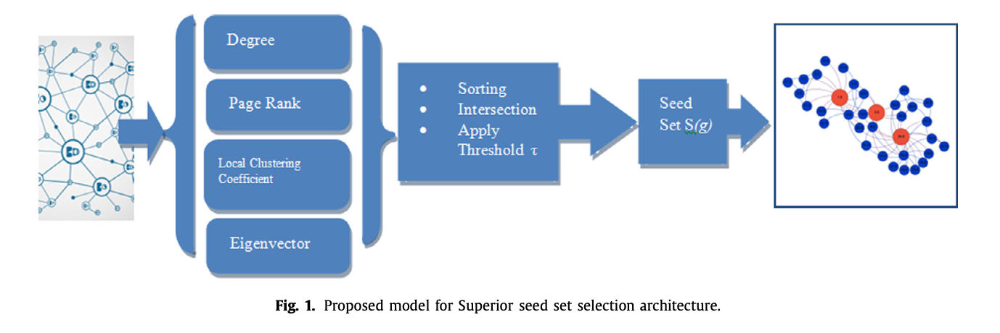
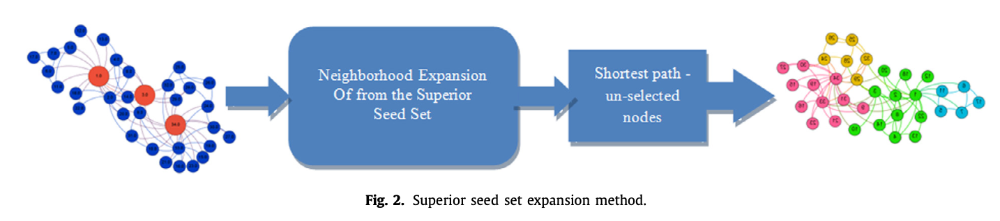
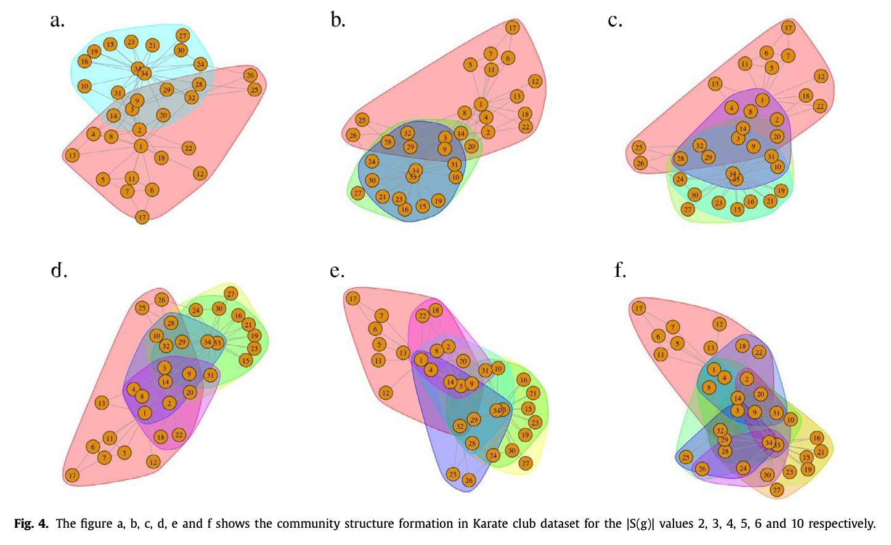

## Overlapping Community Detection using Superior Seed Set Selection in Social Networks

### Authors
- Belfin R.V. (Corresponding author: belfin@karunya.edu)
- Grace Mary Kanaga E.
- Piotr Bródka

### Affiliations
1. Department of Computer Sciences Technology, Karunya Institute of Technology and Sciences, Coimbatore, India
2. Department of Computational Intelligence, Faculty of Computer Science and Management, Wrocław University of Science and Technology, Wrocław, Poland

### Abstract
This paper proposes a strategy to locate superior seed sets by applying various centrality measures for detecting overlapping communities in social networks. The algorithm's effectiveness is evaluated based on intra-cluster and inter-cluster densities, showing significant runtime improvement compared to existing methods.

---

## 1. Introduction
Community discovery in social networks is expanding rapidly. Seed-based algorithms identify key nodes (seeds) around which communities form. This study proposes a unified model for superior seed set selection using multiple centrality measures.

### 1.1 Centrality Measures
- **Degree Centrality**: Number of links a node has.
- **Closeness Centrality**: Nodes that can influence others quickly.
- **Betweenness Centrality**: Shortest paths passing through a node.
- **Eigenvector Centrality**: Influence based on neighbors' centrality.
- **Page Rank Centrality**: Quality and number of links to a node.
- **Local Clustering Coefficient**: Neighbors forming a complete graph.

## 2. Literature Survey
Seed selection is vital for influence propagation and community detection. Various algorithms use different strategies for seed selection and expansion.

## 3. Superior Seed Set Selection Method
The proposed method involves two steps:
1. Superior seed set selection (4-S)
2. Superior seed set expansion

### 3.1 Superior Seed Set Selection (4-S)
The 4-S algorithm uses centrality measures to identify superior seeds. It involves computing centrality measures, sorting nodes, applying a threshold to select top nodes, and intersecting the sets to find common superior nodes.

### 3.2 Superior Seed Set Expansion
The seed expansion algorithm extends the superior seed set to form communities. It includes creating a distance matrix, determining expansion distance, and adding nodes to communities based on proximity to seeds.

## 4. Results and Discussion
The proposed algorithm was tested on real-world datasets, showing better internal and external density. It was compared with other algorithms, demonstrating improved runtime.

### 4.1 Density Measures
The quality of identified communities was evaluated using graph density, intra-cluster density, and inter-cluster density. Good communities have high internal density and low inter-cluster density.

### 4.2 Experiment
The algorithm was tested on datasets like Karate, Dolphin, and Football networks. Results showed effective identification of superior seed sets and formation of overlapping communities.

## 5. Conclusion
The proposed strategies effectively identified and formed genuine communities, showing improvements in runtime and community quality. Future work will optimize seed expansion and explore other centrality measures.

## Acknowledgement
Supported by The National Science Centre, Poland (project no. 2016/21/D/ST6/02408) and Wrocław University of Science and Technology statutory funds.

---

### Images

